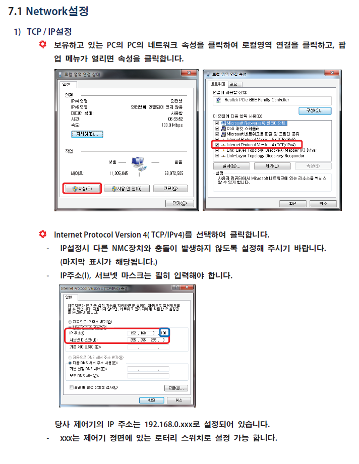

# pyPAIX
PAIX RemoteIO 파이썬 API
※ 프로토콜은 'doc/NMC2-Protocol-Manual(V2.1.3).pdf' 의 내용을 참고 하였음

## 사용방법
    
### 0. 네트워크 셋업
※ 자세한 사항은 doc/NMC2-Series-Hardware-Manual(V2.6).pdf 참고

### 1. RemoteIO: 서버, 본 API: 클라이언트로
### 2. 지원 함수는 아래와 같다.
    1. checkIn(): 전체 DI 확인
    2. checkOut(): 전체 DO 상태 확인
    3. write(pinNum, status): 해당 핀 DO 설정 (0:OFF, 1:ON)
    4. toggle(pinNum): 해당 핀 DO 상태 변경
    5. read(pinNum): 해당 핀 DI 확인 (0:OFF, 1:ON, pinNum: 0~15)
    5. writeAll(): 추가예정
    6. mWrite(): 추가예정
    7. mToggle(): 추가예정
 
### 3. 예시 
    from nmc2_DIO import DIO
    import time

    io = DIO("192.168.0.11",1000)

    io.toggle(0)
    time.sleep(1)
    
    io.toggle(1)

## 추가 예정 기능 (누가좀 해줘라)
### 1 DI callback 기능
별도 쓰레드를 통해 다른 port로 접속하여 "checkIn()" 계속 수행

### 2 예비 Port 접속 기능
### 3 check 해석 기능
### 4 log 배출 기능
